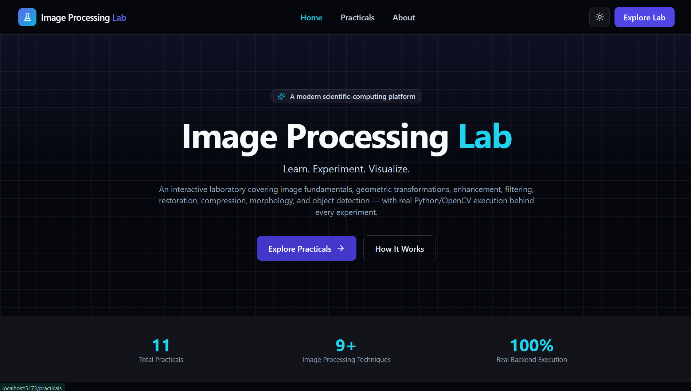
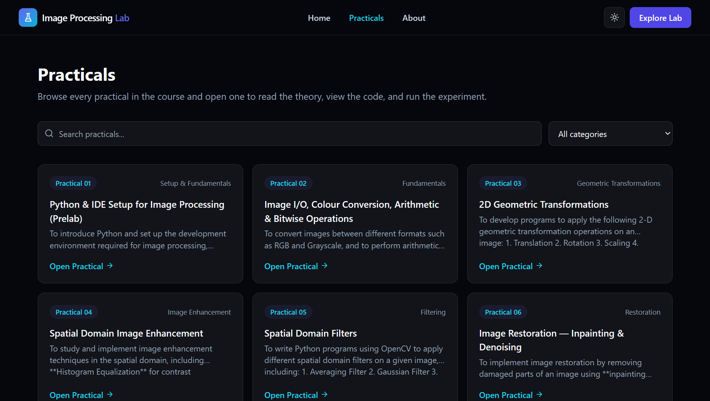
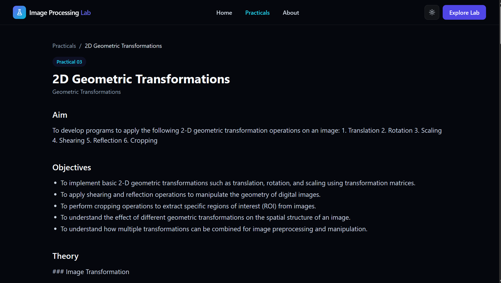

# 🧪 Image Processing Lab

### Interactive Image Processing Laboratory for Students

<p align="center">
  
  
  
  
  
  
</p>

<p align="center">
  <strong>A browser-based interactive laboratory for learning, experimenting with, and understanding digital image processing.</strong>
</p>

<p align="center">
  Upload an image → Configure parameters → Run real processing → Analyze results → Generate your practical report
</p>

---

## 🎬 Demo

> See the Image Processing Lab in action.

<p align="center">
  
</p>

> 💡 **Tip:** Replace `docs/demo.gif` with your actual demo GIF.

---

## 📸 Screenshots

### 🏠 Home / Dashboard

<p align="center">
  
</p>

### 🧪 Practicals Dashboard

<p align="center">
  
</p>

### 🔬 Practical Workspace

<p align="center">
  
</p>

### 📊 Processing Results

<p align="center">
  
</p>

<<<<<<< HEAD
> 📌 **Screenshot paths**
>
> Store your screenshots inside:
>
> `docs/screenshots/`
>
> and update the filenames above if necessary.

---
=======
>>>>>>> e6cca17 (Added screenshots and Demo.gif . Also make some changes in readme)

# ✨ Features

## 🧪 11 Interactive Practicals

Covers the major concepts taught in the Image Processing Laboratory:

* 🖼️ Image Fundamentals
* 🔄 Geometric Transformations
* ☀️ Spatial-Domain Enhancement
* 🎚️ Image Filtering
* 🩹 Image Restoration & Inpainting
* 🗜️ Lossless Image Compression
* 🧱 Morphological Operations
* 🎯 Correlation-Based Object Detection
* 🌈 Colour Space Conversion
* 📐 Edge Detection
* 📊 Edge-Detection Comparison

Every practical is connected to a **real backend image-processing pipeline**.

---

## ⚡ Real Image Processing

This isn't a collection of static screenshots or fake processing animations.

Uploaded images are processed using actual:

* OpenCV
* NumPy
* Pillow
* Matplotlib

The frontend communicates with the FastAPI backend, which performs the requested operation and returns the generated results.

```text
User Image
     │
     ▼
React Frontend
     │
     │ API Request
     ▼
FastAPI Backend
     │
     ▼
Practical Processor
     │
 ┌───┴───────────────┐
 │ OpenCV            │
 │ NumPy             │
 │ Pillow            │
 │ Matplotlib        │
 └───┬───────────────┘
     │
     ▼
Processing Result
     │
     ▼
Interactive UI
```

---

## 💻 Reference Python Code Viewer

Each practical provides its corresponding Python implementation with:

* Syntax highlighting
* Line numbers
* Copy-to-clipboard
* Fullscreen viewing
* Easy-to-read formatting

Students can understand the theory **and** see how the algorithm is implemented.

---

## 🖱️ Interactive Image Upload

Upload images using:

* Drag & drop
* File picker
* Image validation
* File-size validation
* Dimension validation
* Practical-specific input requirements

---

## 🎛️ Dynamic Parameters

Each practical provides its own controls.

Examples include:

```text
Kernel Size
Threshold
Sigma
Rotation Angle
Scaling Factor
Morphological Kernel
Inpainting Radius
Color Space
Edge Detection Method
```

Parameters can be adjusted and reset directly from the UI.

---

## 📊 Rich Processing Results

The application supports multiple types of outputs:

| Output             | Supported |
| ------------------ | :-------: |
| Processed Images   |     ✅     |
| Histograms         |     ✅     |
| Charts             |     ✅     |
| Numeric Values     |     ✅     |
| Tables             |     ✅     |
| Comparison Results |     ✅     |

Results are rendered dynamically based on the backend response.

---

## 📄 Automatic PDF Reports

Generate a formatted practical report with one click.

The report can include:

* Student information
* Aim
* Objectives
* Theory
* Algorithm
* Input image
* Parameters
* Processing results
* Output images
* Histograms / charts
* Conclusion

Reports are generated using **ReportLab**.

---

## 🌙 Dark & Light Mode

Switch between dark and light themes with your preference persisted across sessions.

---

## 📱 Fully Responsive

Designed to work across:

* 🖥️ Desktop
* 💻 Laptop
* 📱 Mobile
* 📲 Tablet

The interface adapts to different screen sizes while keeping the laboratory workflow simple.

---

# 🏗️ Architecture

The application follows a modular frontend-backend architecture.

```text
                    ┌──────────────────────┐
                    │      React UI        │
                    │ Vite + TS + Tailwind │
                    └──────────┬───────────┘
                               │
                         REST API / HTTP
                               │
                               ▼
                    ┌──────────────────────┐
                    │      FastAPI         │
                    │   API + Validation   │
                    └──────────┬───────────┘
                               │
                               ▼
                    ┌──────────────────────┐
                    │ Practical Registry   │
                    └──────────┬───────────┘
                               │
                               ▼
                    ┌──────────────────────┐
                    │ Practical Processor  │
                    └──────────┬───────────┘
                               │
               ┌───────────────┼───────────────┐
               ▼               ▼               ▼
            OpenCV           NumPy          Pillow
                               │
                               ▼
                          Matplotlib
                               │
                               ▼
                    ┌──────────────────────┐
                    │ Processing Result    │
                    └──────────┬───────────┘
                               │
                  ┌────────────┴────────────┐
                  ▼                         ▼
             React Results             PDF Report
                                       (ReportLab)
```

---

# 📂 Project Structure

```text
Image-Processing-Lab/
│
├── backend/
│   ├── app/
│   │   ├── api/
│   │   ├── processors/
│   │   ├── services/
│   │   ├── schemas/
│   │   └── reports/
│   │
│   ├── tests/
│   ├── requirements.txt
│   └── .env.example
│
├── frontend/
│   ├── src/
│   ├── public/
│   ├── package.json
│   └── .env.example
│
├── content/
│   └── practicals/
│       ├── practical-01.json
│       ├── practical-02.json
│       └── ...
│
├── docs/
│   ├── ARCHITECTURE.md
│   ├── PRACTICALS.md
│   ├── DEPLOYMENT.md
│   ├── demo.gif
│   └── screenshots/
│       ├── home.png
│       ├── practicals.png
│       ├── workspace.png
│       └── results.png
│
├── Image_Processing_lab.md
├── CLAUDE.md
├── LICENSE
└── README.md
```

---

# 🧰 Technology Stack

### Frontend

<p>
  
  
  
  
</p>

* React
* Vite
* TypeScript
* Tailwind CSS
* React Router
* lucide-react

### Backend

<p>
  
  
</p>

* Python 3.11+
* FastAPI
* Pydantic

### Image Processing

* OpenCV
* NumPy
* Pillow
* Matplotlib

### Reporting

* ReportLab

### Testing

* pytest

---

# 🚀 Getting Started

## Prerequisites

Make sure you have installed:

* Python **3.11+**
* Node.js **18+**
* npm

---

## 1️⃣ Clone the Repository

```bash
git clone https://github.com/YOUR-USERNAME/image-processing-lab.git

cd image-processing-lab
```

---

# 🔙 Backend Setup

Navigate to the backend:

```bash
cd backend
```

Create a virtual environment:

### Windows

```powershell
python -m venv .venv

.venv\Scripts\activate
```

### macOS / Linux

```bash
python3 -m venv .venv

source .venv/bin/activate
```

Install dependencies:

```bash
pip install -r requirements.txt
```

Create your environment file:

```bash
cp .env.example .env
```

### Windows PowerShell

```powershell
Copy-Item .env.example .env
```

Start the backend:

```bash
uvicorn app.main:app --reload --port 8000
```

Backend:

```text
http://localhost:8000
```

FastAPI documentation:

```text
http://localhost:8000/docs
```

---

# 🎨 Frontend Setup

Open a new terminal:

```bash
cd frontend
```

Install dependencies:

```bash
npm install
```

Create the environment file:

```bash
cp .env.example .env
```

For Windows:

```powershell
Copy-Item .env.example .env
```

Start the development server:

```bash
npm run dev
```

Frontend:

```text
http://localhost:5173
```

---

# 🔐 Environment Variables

## Backend

`backend/.env`

| Variable                | Description                 | Default                 |
| ----------------------- | --------------------------- | ----------------------- |
| `ENVIRONMENT`           | Application environment     | `development`           |
| `CORS_ORIGINS`          | Allowed frontend origins    | `http://localhost:5173` |
| `MAX_UPLOAD_SIZE_BYTES` | Maximum upload size         | `15728640`              |
| `MAX_IMAGE_DIMENSION`   | Maximum image dimension     | `6000`                  |
| `CONTENT_DIR`           | Practical content directory | `../content/practicals` |

## Frontend

`frontend/.env`

| Variable       | Description     | Default                 |
| -------------- | --------------- | ----------------------- |
| `VITE_API_URL` | Backend API URL | `http://localhost:8000` |

---

# 🧪 Running Tests

Backend tests use **pytest**.

```bash
cd backend

pytest
```

The test suite covers:

* Practical processors
* Processor registry
* Image validation
* Invalid parameters
* Missing images
* Error handling
* Processing results

Each practical processor is tested to ensure it produces a valid successful `ProcessingResult` for valid input.

---

# 📦 Production Build

## Frontend

```bash
cd frontend

npm run build
```

The production build will be generated inside:

```text
frontend/dist/
```

Preview the production build:

```bash
npm run preview
```

## Backend

The backend does not require a separate build step.

Run it with:

```bash
uvicorn app.main:app --host 0.0.0.0 --port 8000
```

---

# ☁️ Deployment

The application can be deployed using separate frontend and backend services.

### Frontend

Recommended:

* Vercel
* Netlify
* GitHub Pages

### Backend

Recommended:

* Render
* Railway
* Fly.io
* Any Python/FastAPI-compatible hosting platform

For complete deployment instructions, see:

[`docs/DEPLOYMENT.md`](docs/DEPLOYMENT.md)

---

# ➕ Adding a New Practical

The application is designed to be extensible.

To add a new practical:

### 1. Add the content

Create:

```text
content/practicals/<id>.json
```

following the project schema.

### 2. Add the processor

Create:

```text
backend/app/processors/<id>.py
```

implementing:

```python
process(images, params) -> ProcessingResult
```

### 3. Register the processor

Update:

```text
backend/app/processors/registry.py
```

### 4. Add tests

Update:

```text
backend/tests/test_processors.py
```

### 5. Done 🎉

The frontend should require **no changes** because the UI is driven by the practical registry and structured content.

---

# 🎓 Educational Purpose

This project was designed to make traditional image-processing laboratory work more interactive.

Instead of following a workflow like:

```text
Read Theory
    ↓
Copy Code
    ↓
Run Code
    ↓
Look at Output
    ↓
Write Report
```

students can use:

```text
Learn
  ↓
Experiment
  ↓
Adjust Parameters
  ↓
Run Real Processing
  ↓
Analyze Results
  ↓
Understand the Algorithm
  ↓
Generate Report
```

This makes the laboratory experience more visual, interactive, and easier to explore.

---

# 🛡️ Design Principles

The project follows several core principles:

### 🔬 Real Processing

No fake or pre-generated processing results.

### 🧩 Modular Architecture

Each practical is isolated into its own processor.

### 📚 Single Source of Truth

Practical content is stored in structured JSON and shared between the application and report generator.

### 🎨 Generic Frontend

The UI is designed to render practicals dynamically rather than requiring custom frontend code for every experiment.

### 🧪 Testable

Processors and core backend services have automated tests.

### ♿ Accessible

The interface is designed with responsive layouts, keyboard accessibility, and clear interactive controls.

---

# 🤝 Contributing

Contributions are welcome!

Before making changes:

1. Read [`CLAUDE.md`](CLAUDE.md).
2. Follow the existing project structure.
3. Add tests for new backend functionality.
4. Keep `docs/PRACTICALS.md` synchronized with the practical content.
5. Do not modify the underlying course content without a valid reason.

---

# 📚 Documentation

| Document                                             | Description                                  |
| ---------------------------------------------------- | -------------------------------------------- |
| [`CLAUDE.md`](CLAUDE.md)                             | Engineering rules and development guidelines |
| [`docs/ARCHITECTURE.md`](docs/ARCHITECTURE.md)       | System architecture                          |
| [`docs/PRACTICALS.md`](docs/PRACTICALS.md)           | Practical-to-processor mapping               |
| [`docs/DEPLOYMENT.md`](docs/DEPLOYMENT.md)           | Deployment instructions                      |
| [`Image_Processing_lab.md`](Image_Processing_lab.md) | Original laboratory course content           |

---

# 📄 License

This project is licensed under the **MIT License**.

See [`LICENSE`](LICENSE) for details.

---

<div align="center">

## 🧪 Image Processing Lab

**Learn • Experiment • Process • Analyze • Report**

Built with ❤️ using React, FastAPI, Python, OpenCV, and modern web technologies.

⭐ **If you find this project useful, consider giving it a star!**

</div>
